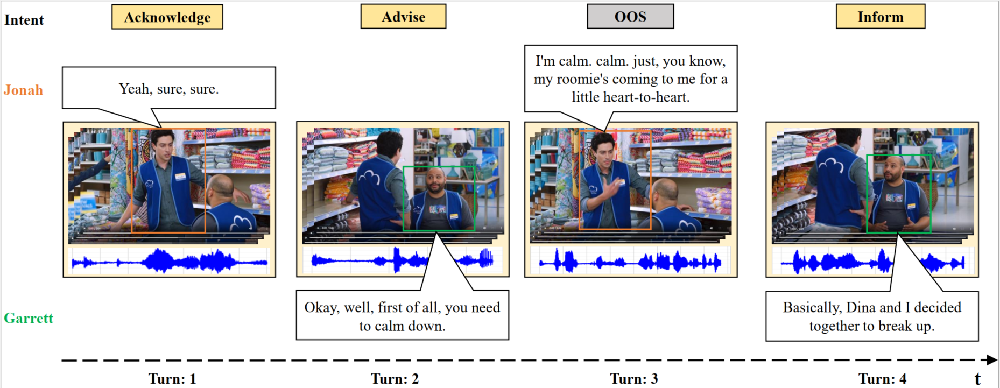
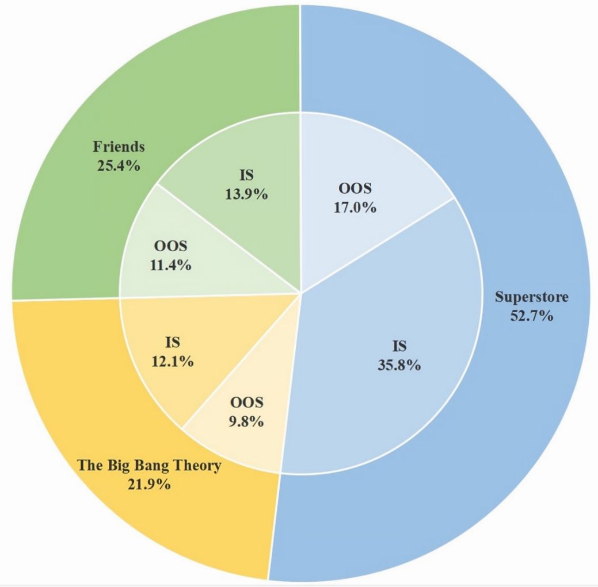
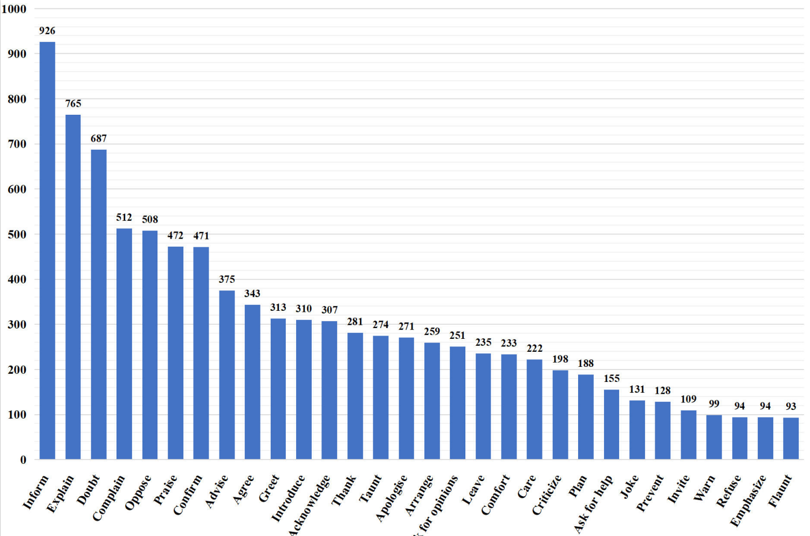
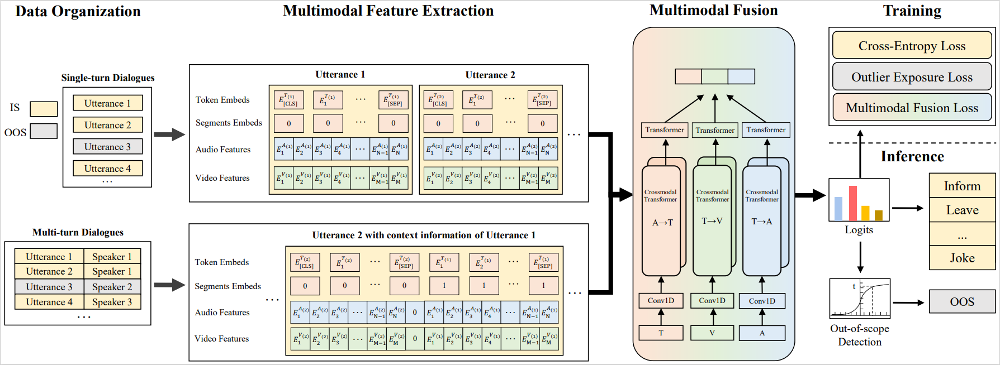

# MIntRec2.0

<p align="center">
  <a target="_blank">
    
  </a>
<a target="_blank">
    
  </a>
   <a target="_blank">
    
  </a>
<br><br>
    <a href="#Features">Features</a> • <a href="#Download">Download</a> • <a href="#Dataset Description">Dataset Description</a> • <a href="#Benchmark Framework">Benchmark Framework</a> • <a href="#Quick start">Quick start</a>
<br>
</p>

MIntRec2.0 is a large-scale multimodal multi-party benchmark dataset for  intent recognition and out-of-scope detection in conversations. We also provide benchmark framework and evaluation codes for usage.

Example:


## Updates 🔥 🔥 🔥 

| Date 	| Announcements 	|
|-	|-	|
| 1/2024  | 🎆 🎆 The first large-scale multimodal intent dataset has been released. Refer to the directory [MIntRec2.0](https://github.com/thuiar/MIntRec2.0) for the dataset and codes. Read the paper -- [MIntRec2.0: A Large-scale Benchmark Dataset for Multimodal Intent Recognition and Out-of-scope Detection in Conversations (Published in ICLR 2024)](https://openreview.net/forum?id=nY9nITZQjc).  |
| 10/2022  | 🎆 🎆 The first multimodal intent dataset is published. Refer to the directory [MIntRec](https://github.com/thuiar/MIntRec) for the dataset and codes. Read the paper -- [MIntrec: A New Dataset for Multimodal Intent Recognition (Published in ACM MM 2022)](https://dl.acm.org/doi/abs/10.1145/3503161.3547906).  |

---------------------------------------------------------------------------


## Features

MIntRec2.0 has the following features:

- **Large in Scale**: Compared with our first version of multimodal intent recognition dataset ([MIntRec](https://github.com/thuiar/MIntRec)), MIntRec2.0 increase the data-scale from 2.2K to 15K, with 30 intent classes, 9.3K in-scope and 5.7K out-of-scope annotated utterances with text, video, and audio modalities.
- **Multi-turn & Multi-party Dialogues**: It contains 1,245 dialogues with an average of 12 utterances per dialogue in continuous conversations. Each utterance has an intent label in each dialogue. Each dialogue has at least two different speakers with annotated speaker identities for each utterance.

- **Out-of-scope Detection**: As real-world dialogues are in the open-world scenarios as suggested in [TEXTOIR](https://github.com/thuiar/TEXTOIR), we further include an OOS tag for detecting those utterances that do not belong to any of existing intent classes. They can be used for out-of-distribution detection and improve system robustness.

## Download

### Zenodo
The brief version of the dataset (text and video, audio feature files, 7G) can be downloaded from [zenodo](https://zenodo.org/record/8041676).

### Feature data
We provide video feature files, audio feature files, and text annotation files (9G), which can be downloaded from [Google Drive](https://drive.google.com/drive/folders/1fcNqXGDLFQfM3gNslG9qHdzl-_WjmvY3?usp=sharing). 


### Raw data
We also provide raw video data (13G), which can be downloaded from [Google Drive](https://drive.google.com/drive/folders/1jFZnE_TYKGMv6OJCG6waEc-JVfTCb6en?usp=drive_link). 


## Dataset Description

* Data sources: The raw videos are collected from three TV series: Superstore, The Big Bang Theory, and Friends. 
* Dialogue division: We manually divide dialogues based on the scenes and episode.
* Speaker information: We manually annotate 21, 7, 6 main characters in Superstore, The Big Bang Theory, and Friends, respectively. 
* Intent classes
    * Express emotions or attitudes (16): doubt, acknowledge, refuse, warn, emphasize, complain, praise, apologize, thank, criticize, care, agree, oppose, taunt, flaunt, joke
    * Acheve goals (14): ask for opinions, confirm, explain, invite, plan, inform, advise, arrange, introduce, comfort, leave, prevent, greet, ask for help

### Statistics

| Item                                      | Statistics |
| ----------------------------------------- | ---------- |
| Number of coarse-grained intents          | 2          |
| Number of fine-grained intents            | 30         |
| Number of dialogues                       | 1,245      |
| Number of utterances                      | 15,040     |
| Number of words in utterances             | 118,477    |
| Number of unique words in utterances      | 9,524      |
| Average length of utterances              | 7.0        |
| Maximum length of utterances              | 46         |
| Average video clip duration               | 3.0 (s)    |
| Maximum video clip duration               | 19.9 (s)   |
| Video hours                               | 12.3 (h)   |

### Data distribution of in-scope (IS) and out-of-scope (OOS) samples:  



### Intent distribution:



## Benchmark Framework

We present a framework to benchmark multimodal intent understanding and out-of-scope detection in both single-turn and multi-turn conversational scenarios.

The overall framework:  


The framework contains 4 main modules:
* Data Organization: Single-turn dialogues use utterance-level samples as inputs. Multi-turn dialogues are arranged chronologically based on the order in which the speakers take their turn. 
* Multimodal Feature Extraction: Extracting features from text, video, and audio modalities. For multi-turn dialogues, we concatenate the context information with the current utterance and separate them with a special token.
* Multimodal Fusion: Multimodal fusion methods (e.g., MAG-BERT, MulT) can be used for fusing different modalities.
* Training: In-scope data uses cross-entropy loss. Out-of-scope data uses outlier exposure loss. It may also contain the multimodal fusion loss for capturing cross-modal interactions.
* Inference: Open set recognition method (e.g., DOC) can be used to identify K known classes and detect one out-of-scope class.

## Quick start

1. Use anaconda to create Python environment

   ```
   conda create --name mintrec python=3.9
   conda activate mintrec
   ```
2. Install PyTorch (Cuda version 11.2)

   ```
   conda install pytorch torchvision torchaudio cudatoolkit=11.3 -c pytorch
   ```
3. Clone the MIntRec repository.

   ```
   git clone git@github.com:thuiar/MIntRec2.0.git
   cd MIntRec
   ```
4. Install related environmental dependencies

   ```
   pip install -r requirements.txt
   ```
5. Run examples (Take mag-bert as an example, more can be seen [here](./examples))

   ```
   sh examples/run_mag_bert_baselines.sh
   ```
   
## Citations

If this work is helpful, or you want to use the codes and results in this repo, please cite the following papers:

* [MIntRec2.0: A Large-scale Dataset for Multimodal Intent Recognition and Out-of-scope Detection in Conversations](https://openreview.net/forum?id=nY9nITZQjc)  
* [MIntRec: A New Dataset for Multimodal Intent Recognition](https://dl.acm.org/doi/10.1145/3503161.3547906)

```
@inproceedings{MIntRec2.0,
   title={{MI}ntRec2.0: A Large-scale Benchmark Dataset for Multimodal Intent Recognition and Out-of-scope Detection in Conversations},
   author={Zhang, Hanlei and Wang, Xin and Xu, Hua and Zhou, Qianrui and Su, Jianhua and Zhao, Jinyue and Li, Wenrui and Chen, Yanting and Gao, Kai},
   booktitle={The Twelfth International Conference on Learning Representations},
   year={2024},
   url={https://openreview.net/forum?id=nY9nITZQjc}
}
```
```
@inproceedings{MIntRec,
   author = {Zhang, Hanlei and Xu, Hua and Wang, Xin and Zhou, Qianrui and Zhao, Shaojie and Teng, Jiayan},
   title = {MIntRec: A New Dataset for Multimodal Intent Recognition},
   year = {2022},
   booktitle = {Proceedings of the 30th ACM International Conference on Multimedia},
   pages = {1688–1697},
}
```

The dataset and camera ready version of the paper will be updated recently. 

